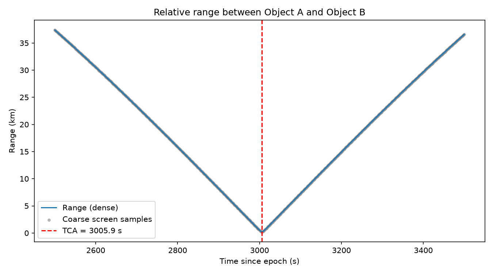

# Satellite Collision Predictor — From Scratch

A working, tested conjunction-assessment (satellite collision prediction)
pipeline, built up in stages: orbit propagation → close-approach screening
→ precise time-of-closest-approach → probability of collision (Pc).

This is the same conceptual pipeline that real Space Situational Awareness
systems (18th Space Defense Squadron, ESA's Space Debris Office, commercial
providers like LeoLabs) use, simplified to something you can read end to end
and run on your laptop.



*Two satellites in crossing orbits approach to within 215 m at closest approach — this plot is generated by `examples/demo_two_sats.py`.*

```
satcollide/
├── src/
│   ├── orbits.py        # Keplerian elements -> state vectors, numerical propagation
│   ├── conjunction.py   # screening, TCA refinement, probability of collision
│   └── real_data.py     # optional: real TLEs + SGP4 (needs internet, run on your machine)
├── examples/
│   └── demo_two_sats.py # full worked example, produces output/range_plot.png
├── tests/
│   └── test_conjunction.py
├── output/               # demo writes its plot here
└── requirements.txt
```

Every piece of physics below was actually run and checked (energy
conservation, brute-force cross-checks, closed-form Pc limits) — see
**Step 6**.

---

## Step 0 — The concept, in one page

Predicting a satellite collision is four steps:

1. **Propagate**: know where each object will be at any future time.
2. **Screen**: cheaply reject the millions of object-pairs that never get
   close, so you don't waste effort on them.
3. **Refine**: for surviving pairs, precisely find the Time of Closest
   Approach (TCA) and the miss distance.
4. **Assess risk**: convert miss distance + how well you know each orbit
   (position uncertainty) into a Probability of Collision (Pc) — a single
   number operators use to decide whether to maneuver.

You never get a yes/no "will they collide" answer — you get "how close,
how likely, given what we know." That's the honest version of the problem,
and it's what's built below.

---

## Step 1 — Environment setup

```bash
python3 -m venv venv
source venv/bin/activate
pip install -r requirements.txt
```

`numpy`, `scipy`, and `matplotlib` do all the real work here: numerical
integration, root-finding/optimization, and plotting. `sgp4` and
`requests` are only needed for Step 7 (real tracked-object data).

---

## Step 2 — Represent an orbit (`src/orbits.py`)

Everything starts from a **state vector**: position `r` (km) and velocity
`v` (km/s) in an Earth-centered inertial frame. It's easier to *think* in
**Keplerian elements** (semi-major axis, eccentricity, inclination, etc.),
so the first thing you need is the conversion:

```python
import numpy as np

MU_EARTH = 398600.4418   # km^3/s^2 -- Earth's gravitational parameter
R_EARTH = 6378.137       # km

def kepler_to_state(a, e, i, raan, argp, nu, mu=MU_EARTH):
    """Classical orbital elements -> Cartesian state vector (r, v)."""
    p = a * (1 - e**2)
    r_mag = p / (1 + e * np.cos(nu))

    # Position & velocity in the perifocal (orbit-plane) frame
    r_pqw = r_mag * np.array([np.cos(nu), np.sin(nu), 0.0])
    v_pqw = np.sqrt(mu / p) * np.array([-np.sin(nu), e + np.cos(nu), 0.0])

    # Rotate perifocal -> Earth-centered inertial frame
    cO, sO = np.cos(raan), np.sin(raan)
    ci, si = np.cos(i), np.sin(i)
    cw, sw = np.cos(argp), np.sin(argp)
    R = np.array([
        [cO*cw - sO*sw*ci, -cO*sw - sO*cw*ci,  sO*si],
        [sO*cw + cO*sw*ci, -sO*sw + cO*cw*ci, -cO*si],
        [sw*si,             cw*si,             ci   ],
    ])
    return R @ r_pqw, R @ v_pqw
```

`a` = semi-major axis, `e` = eccentricity, `i` = inclination, `raan` =
right ascension of ascending node, `argp` = argument of perigee, `nu` =
true anomaly (all angles in radians). This is standard classical-elements
math — every orbital mechanics textbook (Vallado's *Fundamentals of
Astrodynamics and Applications* is the standard reference) derives it the
same way.

---

## Step 3 — Propagate forward in time

A satellite's motion is governed by Newton's gravity plus small
perturbations. The dominant perturbation in low Earth orbit is **J2**
(Earth isn't a perfect sphere — it bulges at the equator), which causes
real, measurable effects like nodal precession. Skipping it gives visibly
wrong answers within hours.

```python
from scipy.integrate import solve_ivp

J2 = 1.08262668e-3

def _accel(r, mu=MU_EARTH, j2=J2, r_earth=R_EARTH):
    x, y, z = r
    r_norm = np.linalg.norm(r)
    a_two_body = -mu * r / r_norm**3
    factor = 1.5 * j2 * mu * r_earth**2 / r_norm**5
    z2_r2 = 5.0 * z**2 / r_norm**2
    a_j2 = factor * np.array([x*(z2_r2-1), y*(z2_r2-1), z*(z2_r2-3)])
    return a_two_body + a_j2

def _rhs(t, y, mu, j2, r_earth):
    return np.hstack([y[3:6], _accel(y[0:3], mu, j2, r_earth)])

def propagate(r0, v0, t_span, mu=MU_EARTH, j2=J2, r_earth=R_EARTH):
    y0 = np.hstack([r0, v0])
    sol = solve_ivp(_rhs, t_span, y0, args=(mu, j2, r_earth),
                     method="DOP853", rtol=1e-10, atol=1e-10,
                     dense_output=True)
    if not sol.success:
        raise RuntimeError(sol.message)
    return sol
```

**Critical gotcha I hit and want to save you from**: `t_span=(t0, t1)`
tells `solve_ivp` *"the initial state occurs at time t0"* — not "give me
the solution starting from t0". If your state vector is defined at epoch
`t=0` (which it almost always is), always integrate with `t_span=(0, t1)`
and use the returned `sol.sol(t)` (dense output — a continuous
interpolated function) to sample *any* time you actually care about. Get
this backwards and every downstream time is silently shifted — the bug
doesn't crash, it just gives you a plausible-looking wrong answer. I caught
mine with a physics sanity check (see Step 6), which is exactly why that
step exists.

**Sanity check anyone can run**: with `j2=0`, specific orbital energy
`0.5*v² - mu/r` must stay constant along the trajectory (energy
conservation). If it drifts, your integrator tolerances or your force
model has a bug.

---

## Step 4 — Screen for close approaches (`src/conjunction.py`)

Real catalogs track ~40,000+ objects. Checking every pair at high
precision is computationally infeasible, so real systems always screen
first with something cheap, then only refine the survivors. Here, cheap
screening is a coarse fixed-step scan:

```python
def relative_range(sol_a, sol_b, t):
    return np.linalg.norm(sol_a.sol(t)[0:3] - sol_b.sol(t)[0:3])

def coarse_screen(sol_a, sol_b, t0, t1, dt=10.0, threshold_km=50.0):
    times = np.arange(t0, t1 + dt, dt)
    ranges = np.array([relative_range(sol_a, sol_b, t) for t in times])
    windows, in_window, lo = [], False, None
    for k, r in enumerate(ranges):
        if r < threshold_km and not in_window:
            in_window, lo = True, times[max(k-1, 0)]
        elif r >= threshold_km and in_window:
            in_window = False
            windows.append((lo, times[k]))
    if in_window:
        windows.append((lo, times[-1]))
    return windows, times, ranges
```

At catalog scale you'd add cheaper pre-filters before this (e.g. reject
pairs whose apogee/perigee ranges can't possibly overlap) — `real_data.py`
has a note on that.

---

## Step 5 — Refine the time of closest approach

A fixed-step scan can miss the true minimum or get its timing wrong by up
to `dt`. Once you have a bracket window from screening, use continuous
optimization against the *dense* (continuously interpolated) solution:

```python
from scipy.optimize import minimize_scalar

def refine_tca(sol_a, sol_b, t_lo, t_hi):
    result = minimize_scalar(lambda t: relative_range(sol_a, sol_b, t),
                              bounds=(t_lo, t_hi), method="bounded",
                              options={"xatol": 1e-6})
    return result.x, result.fun   # (TCA, miss_distance_km)
```

---

## Step 6 — Probability of collision (Pc)

Miss distance alone is misleading: 200 m is terrifying if you know both
orbits to 10 m accuracy, and irrelevant if you only know them to 5 km.
Pc combines miss distance with **position uncertainty** (covariance).

The standard technique (originating with Foster & Estes, and Chan):
1. At TCA, build the **encounter plane** — the 2D plane perpendicular to
   the relative velocity vector. (Along the relative-velocity direction,
   timing precision doesn't matter for whether they hit; only the
   transverse offset does.)
2. Project the miss vector and the combined position covariance
   (uncertainty of A plus uncertainty of B) into that plane.
3. Integrate the resulting 2D Gaussian probability density over a disk of
   radius = combined hard-body radius (sum of both objects' physical
   radii) — that's the probability their actual positions overlap.

```python
from scipy.integrate import dblquad

def probability_of_collision(miss_vec_2d, cov_2d, hbr_km):
    eigvals, eigvecs = np.linalg.eigh(cov_2d)
    sigma = np.sqrt(eigvals)
    miss_rot = eigvecs.T @ miss_vec_2d   # rotate into principal-axis frame

    def pdf(y, x):
        return (1.0 / (2*np.pi*sigma[0]*sigma[1])) * np.exp(
            -0.5*(((x-miss_rot[0])/sigma[0])**2 + ((y-miss_rot[1])/sigma[1])**2))

    def y_lo(x): return -np.sqrt(max(hbr_km**2 - x**2, 0.0))
    def y_hi(x): return  np.sqrt(max(hbr_km**2 - x**2, 0.0))

    pc, _ = dblquad(pdf, -hbr_km, hbr_km, y_lo, y_hi, epsabs=1e-14, epsrel=1e-10)
    return pc
```

**I verified this against three things you can check yourself:**
- A miss vector many sigma away from a tight covariance gives Pc ≈ 0.
- A **zero** miss vector with equal (isotropic) sigmas has a known
  closed form: `Pc = 1 - exp(-HBR² / (2σ²))`. My numeric integral matched
  it to 6 decimal places.
- **The "Pc paradox"**: for a *fixed* miss distance, Pc rises as you widen
  the covariance from very tight (spreads mass toward the other object) —
  but only up to a point. Once sigma grows past roughly the miss distance
  itself, Pc turns over and *falls* again, because the probability mass
  spreads too thin to concentrate over the small hard-body disk. This is
  a real, well-known effect in the operational literature (a very
  uncertain orbit can look "safer" than a moderately uncertain one purely
  because you know less) — my test suite checks the pipeline reproduces
  it rather than assuming naive monotonic behavior.

Real-world review thresholds commonly cited in the literature: `Pc >
1e-4` typically triggers a closer look; `Pc > 1e-3` to `1e-2` commonly
triggers a maneuver discussion, weighed against fuel cost and the (small
but nonzero) risk of the maneuver itself.

---

## Step 7 — Run the full demo

```bash
python3 examples/demo_two_sats.py
```

This builds two ~700 km-altitude near-polar orbits whose planes cross,
times them to nearly meet at the crossing point, and runs the full
pipeline. Example output:

```
Orbital period ~ 98.8 min. Screening t in [2500.0, 3500.0] s.

Coarse screen found 1 candidate window(s) under 10 km:
  t in [2876.0, 3136.0] s

Refined closest approaches:
  TCA = 3005.930 s   miss distance =   214.71 m

At TCA (t = 3005.930 s):
  3D miss distance   : 214.71 m
  In-plane miss (u,w): (212.51, -30.72) m
  Combined HBR       : 10.0 m
  Probability of collision (Pc): 2.077e-06
  ...with 6x larger position uncertainty, Pc becomes: 8.461e-04
  (this is why operators re-run Pc as fresh tracking data comes in)
```

It also writes `output/range_plot.png` — a V-shaped range-vs-time curve
showing the two objects approaching, reaching TCA, and separating again.

**How the scenario is built** (also in `src/orbits.py`, reusable):
two orbital planes with different inclination/RAAN intersect along a
line through Earth's center. `plane_crossing_direction()` finds that
line; `true_anomaly_for_direction()` finds where on each orbit that
corresponds to. Phasing both objects to arrive there at nearly the same
time — off by a fraction of a second — produces a realistic close
approach instead of a random guess-and-check.

---

## Step 8 — Run the tests

```bash
python3 -m pytest tests/ -v
```

What's checked:
- `kepler_to_state` matches the vis-viva equation for a circular orbit.
- Two-body energy is conserved along a propagated trajectory (catches
  integrator/force-model bugs).
- **Brute force cross-check**: a 1-second-resolution dense grid search
  over the whole window is compared against the fast screen+refine
  pipeline — they must agree on TCA to within the grid step and on miss
  distance to within 10 m.
- Screening correctly returns *zero* candidate windows for two objects
  that never come close (no false positives).
- The Pc integral matches its closed-form limits (see Step 6).
- Pc responds correctly (increases then decreases) to growing
  uncertainty, rather than assuming naive monotonic behavior.

All 6 tests pass in this environment.

---

## Step 9 — Plug in real tracked objects (`src/real_data.py`)

Everything above uses synthetic orbits so the whole thing runs offline.
To use real objects, you need two more libraries and internet access
(**run this on your own machine**, not in a sandboxed one):

```bash
pip install sgp4 requests
```

Real object orbits are published as **TLEs** (Two-Line Elements) by
[CelesTrak](https://celestrak.org/NORAD/elements/) (mirrors official
Space-Track.org catalog data), and propagated with **SGP4**, the
perturbation model matched to how TLEs are generated (a general
Keplerian/J2 propagator like Step 3's, fed a TLE's elements directly,
will drift — TLEs are only self-consistent with SGP4).

```python
from sgp4.api import Satrec, jday
import requests, numpy as np

def fetch_tles(group="stations"):
    url = f"https://celestrak.org/NORAD/elements/gp.php?GROUP={group}&FORMAT=tle"
    lines = requests.get(url, timeout=30).text.strip().splitlines()
    return [(lines[i], lines[i+1], lines[i+2]) for i in range(0, len(lines), 3)]

def propagate_tle(satrec, times_utc):
    jd, fr = np.zeros(len(times_utc)), np.zeros(len(times_utc))
    for k, t in enumerate(times_utc):
        jd[k], fr[k] = jday(t.year, t.month, t.day, t.hour, t.minute,
                             t.second + t.microsecond*1e-6)
    err, pos, vel = satrec.sgp4_array(jd, fr)
    if np.any(err != 0):
        raise RuntimeError("SGP4 error")
    return pos, vel   # TEME frame, km / km/s
```

`src/real_data.py` in this project has the fuller version, including a
catalog-scale coarse screen (`find_close_pairs_over_catalog`) that fetches
a CelesTrak group and scans all pairs. Feed any close pair it finds into
`conjunction.refine_tca` / `probability_of_collision` from Step 4-6 —
the pipeline doesn't care whether the trajectories came from your own
propagator or from SGP4, only that you can evaluate each object's
position at a given time.

One real-world catch: TLEs don't ship a covariance. Operational systems
either get real covariance from precision orbit determination (radar/
laser tracking, GPS for cooperative satellites), or fall back to
generic/conservative uncertainty estimates when only TLEs are available —
published Pc values from TLE-only data should be treated as rough,
because the covariance behind them is usually a guess, not a measurement.

*(Not testable in the sandbox this was built in — no internet access to
PyPI or CelesTrak from there — but this is standard, widely-documented
`sgp4`/`requests` usage; happy to debug it with you against real output
if anything doesn't work on your machine.)*

---

## Where to go from here

- **More objects at once**: replace the two-satellite demo with a loop
  over a catalog (see `find_close_pairs_over_catalog`), and add a cheap
  pre-filter (e.g. reject pairs whose altitude bands can't overlap)
  before the O(N²) coarse screen.
- **Covariance propagation**: real systems propagate the *covariance*
  matrix forward in time too (it grows as predictions get older), not
  just the mean state. That's typically done by propagating a state
  transition matrix alongside the trajectory, or by a Monte Carlo /
  unscented-transform sample of nearby initial states.
- **3D visualization**: plot both trajectories in 3D around a sphere
  representing Earth (matplotlib's `mplot3d` or a small Plotly figure)
  for a much more intuitive picture of the encounter geometry than the
  range-vs-time plot alone.
- **Maneuver planning**: given a risky Pc, compute how large a delta-v
  burn (and in which direction) would push the miss distance outside a
  safety threshold — a natural next module once this pipeline is solid.
